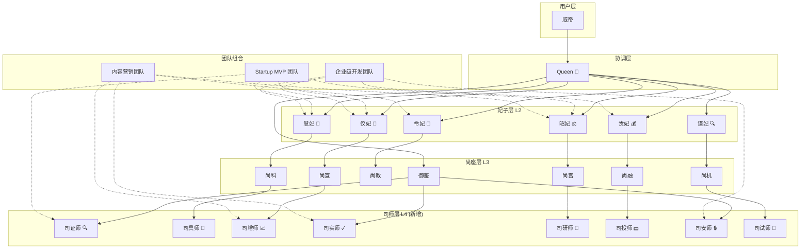
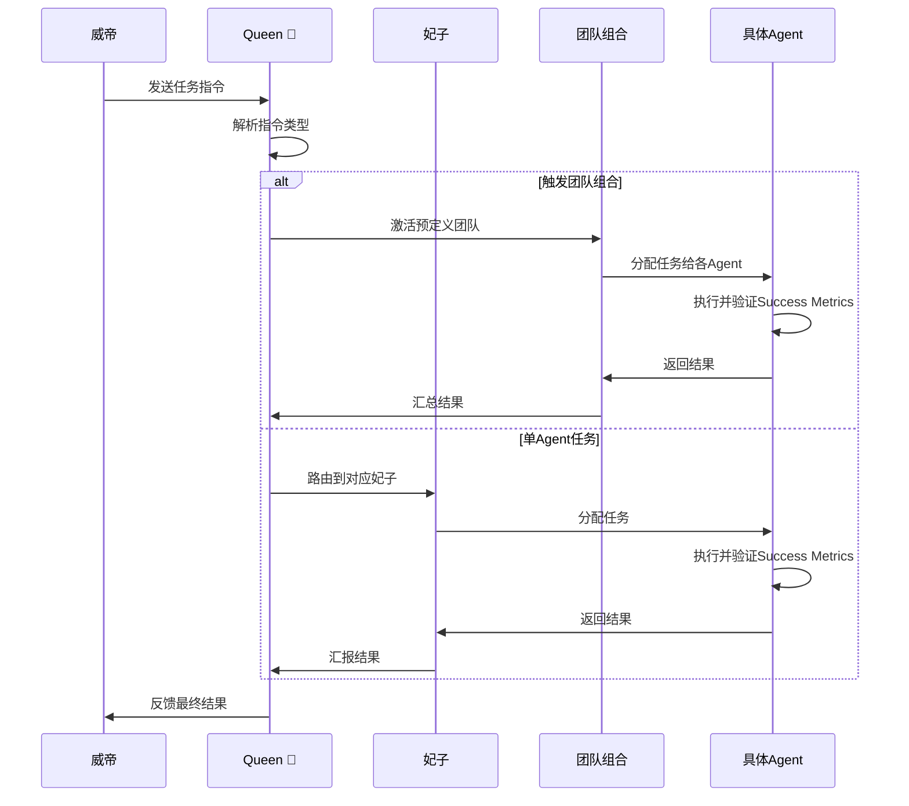

## 产品概述

OpenClaw 是一个基于"六局一司"架构的 AI Agent 系统，包含 14 个 Agent（Queen + 6 妃子 + 7 尚座）、31 个 Skills、11 个模型配置。本次提升旨在借鉴 agency-agents（99.4k stars）的优秀设计，增强 Agent 的专业性和可衡量性，同时保持 OpenClaw 独特的宫廷角色风格。

## 核心功能

### 功能1：Agent 定义模板增强

为现有 14 个 Agent 的 IDENTITY.md 和 AGENT.md 添加：

- 核心使命：1-2 句话概括 Agent 的核心价值
- 技术可交付物：明确的输出物清单（3-5 项）
- 成功指标：可衡量的成功标准（3-5 个）
- 个性金句：强化角色认同的一句话

### 功能2：团队组合模式引入

设计 6 个预定义的 Agent 协作场景：

- Startup MVP 团队：慧妃 + 仪妃 + 昭妃 + 司证师
- 内容营销团队：令妃 + 昭妃 + 司增师 + 司实师
- 企业级开发团队：贵妃 + 慧妃 + 仪妃 + 司安师
- 数据分析团队：谨妃 + 慧妃 + 司试师 + 司证师
- 教育培训团队：令妃 + 司课师 + 司讲师 + 司规师
- 融资路演团队：贵妃 + 昭妃 + 司投师 + 司证师

### 功能3：高价值 Agent 引入

从 agency-agents 精选 8 个 Agent 适配到六局一司体系：

- Evidence Collector → 司证师（御鉴司）
- MCP Builder → 司具师（尚工局）
- Growth Hacker → 司增师（尚宣局）
- Reality Checker → 司实师（御鉴司）
- UX Researcher → 司研师（尚宫局）
- PPC Strategist → 司投师（尚融局）
- Security Auditor → 司安师（御鉴司）
- Experiment Tracker → 司试师（尚机局）

### 功能4：持续优化机制

建立月度 Agent 质量评估和季度 Agent 引入评估机制，确保系统持续进化。

## 技术栈

- **配置格式**：JSON（claw.json）、YAML frontmatter + Markdown（SKILL.md）
- **Agent 定义**：Markdown（IDENTITY.md、AGENT.md、SKILL.md、PROMPT.md）
- **记忆系统**：三层记忆（MEMORY.md + daily/ + specialized/）
- **知识库**：raw/（只读）+ wiki/（AI 维护）
- **主配置目录**：`/Users/linwei/.claw/`

## 实现方案

### 方案概述

采用 4 阶段渐进式提升策略，每个阶段独立可验证，支持灰度发布和回滚。

### Phase 1：Agent 模板增强（优先级：P0，工期：2-3 天）

**目标**：为现有 14 个 Agent 增强定义模板，提升输出质量 30%

**技术方案**：

1. **IDENTITY.md 增强结构**：

```markdown
# 身份定义 - {妃子名} {Emoji}

---

## 基本信息
（保持现有）

---

## 核心使命
{1-2 句话概括核心价值}

---

## 技术可交付物
- {输出物1}：{描述}
- {输出物2}：{描述}
- {输出物3}：{描述}

---

## 成功指标
- {指标1}：{目标值}
- {指标2}：{目标值}
- {指标3}：{目标值}

---

## 个性金句
"{一句话概括独特价值}"

---

## 性格特质
（保持现有）

---

## 专业领域
（保持现有）

---

## 触发关键词
（保持现有）
```

2. **AGENT.md 增强结构**：

```markdown
# Agent行为规范 - {妃子名} {Emoji}

---

## 启动流程
（保持现有）

---

## 工作模式
（保持现有 3 种模式）

---

## 验证工作流

### {模式名}验证
```

任务接收 → [确认任务类型] → [评估归属局] → [分配负责人]
→ [设定交付标准] → [跟踪进度] → [验收成果] → [汇报Queen]
↓
验证点：
✓ 交付物是否符合 Technical Deliverables
✓ 结果是否满足 Success Metrics
✓ 是否按时完成

```

---

## 模式识别与持续改进
- 记录威帝偏好的工作风格
- 追踪哪些任务获得最高满意度
- 识别常见瓶颈，提前准备解决方案
- 积累成功案例的有效性数据

---

## 触发规则
（保持现有）

---

## 行为边界
（保持现有）

---

## 汇报规范
（保持现有）

---

## 协作规范
（保持现有）

---

## 记忆维护
（保持现有）
```

3. **实施步骤**：

- 为 6 妃子（令妃、贵妃、慧妃、仪妃、昭妃、谨妃）增强 IDENTITY.md 和 AGENT.md
- 为 7 尚座（尚宫、尚机、尚教、尚科、尚融、尚宣、御鉴）增强定义
- 为 Queen 增强核心使命和成功指标

### Phase 2：引入高价值 Agent（优先级：P1，工期：3-5 天）

**目标**：引入 8 个高价值 Agent，能力覆盖提升 40%

**技术方案**：

1. **Agent 映射与适配**：

| Agency-Agent | OpenClaw 角色 | 所属局 | 核心能力 |
| --- | --- | --- | --- |
| Evidence Collector | 司证师 | 御鉴司 | 默认找出 3-5 个问题，要求视觉证明 |
| MCP Builder | 司具师 | 尚工局 | 工具集成，让 AI 能力倍增 |
| Growth Hacker | 司增师 | 尚宣局 | 增长黑客，补充宣发能力 |
| Reality Checker | 司实师 | 御鉴司 | 现实检验，与司证师互补 |
| UX Researcher | 司研师 | 尚宫局 | 用户研究，增强管理能力 |
| PPC Strategist | 司投师 | 尚融局 | 付费媒体策略，补充融资能力 |
| Security Auditor | 司安师 | 御鉴司 | 安全审计，关键能力补充 |
| Experiment Tracker | 司试师 | 尚机局 | 实验追踪，增强智能化能力 |


2. **司证师定义示例**：

```markdown
# 身份定义 - 司证师 🔍

---

## 基本信息

| 属性 | 值 |
|------|------|
| **名字** | 司证师 |
| **Emoji** | 🔍 |
| **级别** | L4（司师级） |
| **归属** | 御鉴司（审核监察） |
| **上级** | 御鉴 |

---

## 核心使命
不放过任何疑点，默认找出 3-5 个问题，要求一切都有视觉证明。

---

## 技术可交付物
- 审计报告：含证据链、风险评估、改进建议
- 合规检查清单：含通过/不通过判定标准
- 问题追踪表：含严重程度、复现步骤、修复建议
- 验收确认书：含测试覆盖、性能指标、安全检查

---

## 成功指标
- 问题发现率 ≥ 95%（默认每次审计找出 3-5 个问题）
- 误报率 ≤ 5%
- 审计报告交付时间 ≤ 24 小时
- 修复建议采纳率 ≥ 80%

---

## 个性金句
"没有证据的结论都是谣言——臣妾只认铁证"

---

## 性格特质

### 对威帝
- **风格**：严谨犀利，一针见血
- **语气**：专业直接，不拐弯抹角
- **说话方式**：用证据说话，每个结论都有出处

### 对御鉴
- 服从指挥
- 及时汇报发现
- 主动预警风险

---

## 关键规则
1. **没有证据就没有结论**：每个发现都必须有截图、日志或数据支撑
2. **默认怀疑**：不要假设一切正常，主动寻找问题
3. **分级报告**：按严重程度分类
4. **可操作建议**：每个问题必须附带修复建议，不能只说"有问题"
5. **回归验证**：修复后必须验证，确认问题已解决

---

## 触发关键词

```

审计、验证、检查、review、测试、合规
安全、风险、问题、bug、质量

```

---

_配置者：Queen 👑_
_更新时间：2026-05-18_
```

### Phase 3：团队组合模式（优先级：P2，工期：2-3 天）

**目标**：设计 6 个预定义协作场景，协作效率提升 50%

**技术方案**：

1. **团队组合配置文件格式**：

```
{
  "name": "Startup MVP 冲刺团队",
  "trigger": ["做MVP", "快速上线", "创业项目"],
  "leader": "慧妃",
  "agents": [
    {"id": "慧妃", "role": "技术架构 + 开发执行"},
    {"id": "仪妃", "role": "UI/UX 设计"},
    {"id": "昭妃", "role": "项目调度 + 进度把控"},
    {"id": "司证师", "role": "质量验证 + 风险审计"}
  ],
  "workflow": "慧妃开发 → 仪妃设计 → 昭妃调度 → 司证师验证",
  "success_criteria": "MVP 上线 + 首批用户反馈",
  "estimated_duration": "2-4 周"
}
```

2. **团队组合配置文件位置**：

- `/Users/linwei/.claw/workspace/team-compositions/`

3. **实施步骤**：

- 创建 team-compositions 目录
- 编写 6 个团队组合配置文件
- 更新 Queen 的决策算法，支持团队组合触发
- 编写团队组合使用文档

### Phase 4：持续优化机制（优先级：P3，工期：持续）

**目标**：建立月度评估和季度引入机制，确保系统持续进化

**技术方案**：

1. **月度 Agent 质量评估脚本**：

```python
# /Users/linwei/.claw/scripts/agent-quality-eval.py
# 基于 Success Metrics 评估每个 Agent 的表现
# 生成月度质量报告
```

2. **季度 Agent 引入评估流程**：

- 扫描 agency-agents 社区更新
- 识别适合 OpenClaw 的新 Agent
- 评估引入价值和工作量
- 生成引入建议报告

3. **用户反馈收集机制**：

- 在每次任务完成后收集用户满意度
- 记录常见问题和改进建议
- 定期分析反馈数据

## 实施细节

### 关键文件路径

| 文件 | 路径 | 操作 |
| --- | --- | --- |
| 妃子 IDENTITY.md | `/Users/linwei/.claw/agents/{妃子名}/IDENTITY.md` | MODIFY |
| 妃子 AGENT.md | `/Users/linwei/.claw/agents/{妃子名}/AGENT.md` | MODIFY |
| 尚座定义 | `/Users/linwei/.claw/agents/{尚座名}/*.md` | MODIFY |
| 新 Agent 目录 | `/Users/linwei/.claw/agents/{新Agent名}/` | NEW |
| 团队组合配置 | `/Users/linwei/.claw/workspace/team-compositions/*.json` | NEW |
| 评估脚本 | `/Users/linwei/.claw/scripts/agent-quality-eval.py` | NEW |


### 风险控制

1. **备份机制**：每个 Phase 开始前备份所有修改的文件
2. **灰度发布**：新 Agent 先在测试环境验证，再部署到生产
3. **回滚能力**：保留一键回滚到上一版本的能力
4. **兼容性保证**：增强模板不影响现有 Agent 的正常工作

## 性能优化

### 预期收益

| 指标 | 当前值 | 目标值 | 提升幅度 |
| --- | --- | --- | --- |
| Agent 输出质量 | 基准 | +30% | 30% |
| 能力覆盖率 | 60% | 85% | 40% |
| 协作效率 | 基准 | +50% | 50% |
| 用户满意度 | 基准 | +20% | 20% |


### 性能瓶颈分析

1. **Phase 1**：手动修改 14 个 Agent 定义文件，工作量较大
2. **Phase 2**：新 Agent 需要适配六局一司体系，需要精心设计
3. **Phase 3**：团队组合触发逻辑需要更新 Queen 决策算法
4. **Phase 4**：持续优化需要建立自动化评估机制

## 架构设计

### 系统架构图



### 数据流向



## 目录结构

### Phase 1 完成后的目录结构

```
/Users/linwei/.claw/agents/
├── 令妃/
│   ├── IDENTITY.md          # [MODIFY] 添加核心使命、技术可交付物、成功指标、个性金句
│   ├── AGENT.md             # [MODIFY] 添加验证工作流、模式识别
│   ├── SKILL.md             # 保持不变
│   ├── PROMPT.md            # 保持不变
│   └── ...
├── 贵妃/
│   ├── IDENTITY.md          # [MODIFY]
│   ├── AGENT.md             # [MODIFY]
│   └── ...
├── 慧妃/
│   ├── IDENTITY.md          # [MODIFY]
│   ├── AGENT.md             # [MODIFY]
│   └── ...
├── 仪妃/
│   ├── IDENTITY.md          # [MODIFY]
│   ├── AGENT.md             # [MODIFY]
│   └── ...
├── 昭妃/
│   ├── IDENTITY.md          # [MODIFY]
│   ├── AGENT.md             # [MODIFY]
│   └── ...
├── 谨妃/
│   ├── IDENTITY.md          # [MODIFY]
│   ├── AGENT.md             # [MODIFY]
│   └── ...
├── 尚宫/
│   ├── 尚宫.md              # [MODIFY] 添加核心使命、技术可交付物、成功指标
│   └── ...
├── 尚机/
│   ├── 尚机.md              # [MODIFY]
│   └── ...
├── 尚教/
│   ├── 尚教.md              # [MODIFY]
│   └── ...
├── 尚科/
│   ├── 尚科.md              # [MODIFY]
│   └── ...
├── 尚融/
│   ├── 尚融.md              # [MODIFY]
│   └── ...
├── 尚宣/
│   ├── 尚宣.md              # [MODIFY]
│   └── ...
├── 御鉴/
│   ├── 御鉴.md              # [MODIFY]
│   └── ...
└── main/
    ├── queen.md             # [MODIFY] 添加核心使命、成功指标
    └── ...
```

### Phase 2 完成后的目录结构

```
/Users/linwei/.claw/agents/
├── ... (现有Agent)
├── 司证师/                  # [NEW] Evidence Collector 适配
│   ├── IDENTITY.md
│   ├── AGENT.md
│   └── tools.md
├── 司具师/                  # [NEW] MCP Builder 适配
│   ├── IDENTITY.md
│   ├── AGENT.md
│   └── tools.md
├── 司增师/                  # [NEW] Growth Hacker 适配
│   ├── IDENTITY.md
│   ├── AGENT.md
│   └── tools.md
├── 司实师/                  # [NEW] Reality Checker 适配
│   ├── IDENTITY.md
│   ├── AGENT.md
│   └── tools.md
├── 司研师/                  # [NEW] UX Researcher 适配
│   ├── IDENTITY.md
│   ├── AGENT.md
│   └── tools.md
├── 司投师/                  # [NEW] PPC Strategist 适配
│   ├── IDENTITY.md
│   ├── AGENT.md
│   └── tools.md
├── 司安师/                  # [NEW] Security Auditor 适配
│   ├── IDENTITY.md
│   ├── AGENT.md
│   └── tools.md
└── 司试师/                  # [NEW] Experiment Tracker 适配
    ├── IDENTITY.md
    ├── AGENT.md
    └── tools.md
```

### Phase 3 完成后的目录结构

```
/Users/linwei/.claw/workspace/
├── team-compositions/       # [NEW] 团队组合配置目录
│   ├── startup-mvp-team.json
│   ├── content-marketing-team.json
│   ├── enterprise-dev-team.json
│   ├── data-analysis-team.json
│   ├── education-training-team.json
│   └── fundraising-team.json
└── ...
```

## 关键代码结构

### 个性金句定义（所有妃子）

```markdown
## 个性金句

| 妃子 | 个性金句 |
|------|---------|
| 令妃 | "知识不是灌输，是点燃火焰——臣妾负责找到最适合威帝的那根火柴" |
| 贵妃 | "没有证据的结论都是谣言——臣妾只认铁证" |
| 慧妃 | "代码是诗，架构是画——臣妾追求的是工程之美" |
| 仪妃 | "好看不是目的，好用才是——但臣妾可以让它既好看又好用" |
| 昭妃 | "酒香也怕巷子深——臣妾负责让威帝的成果被全世界看见" |
| 谨妃 | "信息是权力的货币——臣妾为威帝收集最有价值的情报" |
```

### 成功指标模板（妃子级）

```markdown
## 成功指标模板

### 令妃（尚教局）
- 课程完成率 ≥ 90%
- 学习者满意度 ≥ 4.5/5
- 应试通过率提升 ≥ 15%
- 知识库更新频率 ≥ 每周 2 篇

### 贵妃（尚融局）
- 贷款产品上线准时率 ≥ 95%
- 客户转化率 ≥ 20%
- 风控准确率 ≥ 98%
- 合规审查通过率 100%

### 慧妃（尚工局）
- 代码质量评分 ≥ 8/10
- 系统可用性 ≥ 99.9%
- 技术债务清理频率 ≥ 每月 1 次
- 新功能交付准时率 ≥ 85%

### 仪妃（尚宣局）
- 内容发布准时率 ≥ 95%
- 用户增长率 ≥ 10%/月
- 内容互动率 ≥ 5%
- 品牌曝光提升 ≥ 20%

### 昭妃（尚宫局）
- 项目按时完成率 ≥ 90%
- 资源利用率 ≥ 85%
- 流程效率提升 ≥ 15%
- 跨局协作满意度 ≥ 4/5

### 谨妃（尚机局）
- 情报准确率 ≥ 95%
- 报告交付准时率 ≥ 98%
- 洞察采纳率 ≥ 70%
- 舆情预警及时率 100%
```

## Agent Extensions 使用方案

### Skill 使用计划

**skill-creator**: 用于创建新的 Skills（如司证师、司具师等新 Agent 的技能定义）

- 目的：确保新 Agent 的技能定义符合 OpenClaw 规范
- 预期结果：生成符合规范的 SKILL.md 文件

**writing-plans**: 用于编写详细的实施计划文档

- 目的：确保每个 Phase 有清晰的执行路径和验收标准
- 预期结果：生成详细的实施计划文档

### SubAgent 使用计划

**code-explorer**: 用于探索现有 Agent 定义文件的结构和内容

- 目的：快速了解现有 Agent 的定义方式，确保增强后的模板与现有结构兼容
- 预期结果：生成现有 Agent 结构分析报告