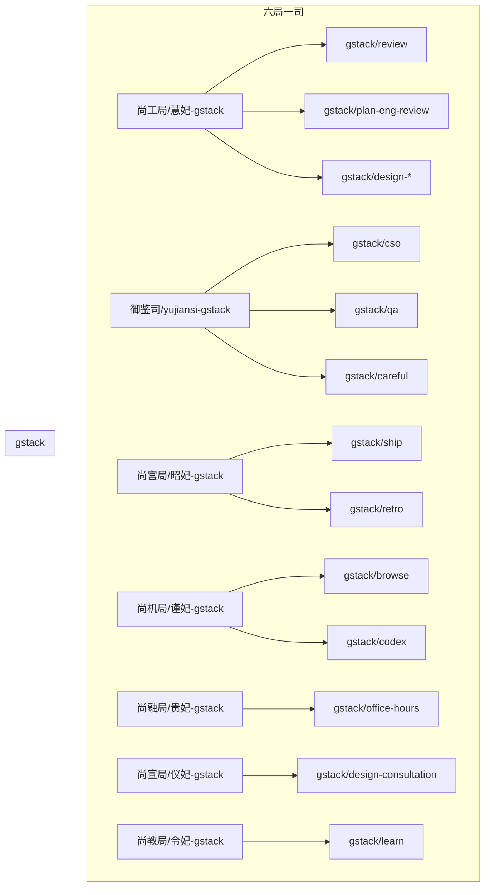

## 用户需求

用户选择"中度映射"集成方案，要求：

1. 为每位妃子创建 gstack 整合技能包装（如 `hui-fei-gstack`）
2. 将 gstack 方法论同步到各局司知识库

## 产品概述

将 Garry Tan 的 gstack（23个 Specialists + 8个 Power Tools）整合到六局一司架构，让每位妃子能够通过专属技能包调用 gstack 能力，同时保持原有 gstack 的独立性。

## 核心功能

- **7个妃子整合技能包**：慧妃、昭妃、谨妃、贵妃、仪妃、令妃各一个，御鉴司一个
- **gstack 方法论文档**：同步到知识库，供所有妃子参考
- **技能策略更新**：将新技能纳入 SKILLS-POLICY.md 管理

## 技术方案

### 技术栈

- **技能定义格式**：YAML frontmatter + Markdown（遵循现有 SKILL.md 结构）
- **技能目录结构**：`{局司}/{妃子}-gstack/abilities/` + `references/` + `scripts/`
- **gstack 调用方式**：通过符号链接 `~/.claude/skills/gstack` 调用原始技能

### 实现方法

**整合策略**：

- 每个妃子技能包作为"包装层"，内部调用 gstack 原始技能
- 保留 gstack 触发词，添加妃子专属触发词
- 将 gstack 工作流嵌入妃子执行流程

**技能包结构**：

```
{局司}/{妃子}-gstack/
├── SKILL.md              # 主技能定义
├── abilities/            # 能力定义（引用 gstack）
├── references/           # 参考资料
└── scripts/              # 调用脚本（可选）
```

### 架构设计



### 目录结构

```
~/.claw/workspace/skills/
├── 尚工局/
│   └── hui-fei-gstack/          # [NEW] 慧妃 gstack 整合
│       ├── SKILL.md
│       ├── abilities/
│       │   ├── code-review.md
│       │   ├── architecture-review.md
│       │   └── design-generation.md
│       └── references/
│           └── gstack-workflow.md
├── 御鉴司/
│   └── yujiansi-gstack/         # [NEW] 御鉴司 gstack 整合
│       ├── SKILL.md
│       ├── abilities/
│       │   ├── security-audit.md
│       │   ├── quality-testing.md
│       │   └── safety-guards.md
│       └── references/
├── 尚宫局/
│   └── gong-fei-gstack/         # [NEW] 昭妃 gstack 整合
│       ├── SKILL.md
│       ├── abilities/
│       │   ├── release-management.md
│       │   └── project-retrospective.md
│       └── references/
├── 尚机局/
│   └── jin-fei-gstack/          # [NEW] 谨妃 gstack 整合
│       ├── SKILL.md
│       ├── abilities/
│       │   ├── web-browsing.md
│       │   └── cross-agent-collab.md
│       └── references/
├── 尚融局/
│   └── rong-fei-gstack/         # [NEW] 贵妃 gstack 整合
│       ├── SKILL.md
│       ├── abilities/
│       │   └── strategy-planning.md
│       └── references/
├── 尚宣局/
│   └── xuan-fei-gstack/         # [NEW] 仪妃 gstack 整合
│       ├── SKILL.md
│       ├── abilities/
│       │   └── content-design.md
│       └── references/
├── 尚教局/
│   └── ling-fei-gstack/         # [NEW] 令妃 gstack 整合
│       ├── SKILL.md
│       ├── abilities/
│       │   └── teaching-reflection.md
│       └── references/
├── gstack/                      # [EXISTING] 原始 gstack 技能
└── SKILLS-POLICY.md             # [MODIFY] 添加新技能

~/.claw/workspace/knowledge-base/wiki/
└── AI工作流/
    ├── gstack方法论.md          # [NEW] gstack 工作流说明
    └── gstack-最佳实践.md       # [NEW] gstack 使用最佳实践
```

### 关键代码结构

**SKILL.md 模板**（慧妃示例）：

```
---
name: hui-fei-gstack
description: 尚工局·慧妃 gstack 整合技能包。整合代码审查、架构评审、设计生成、性能基准测试。触发词：代码审查、架构评审、设计生成、性能测试、review、plan-eng-review。
license: Proprietary
metadata:
  author: Queen
  version: "1.0.0"
  bureau: 尚工局
  fei: 慧妃
  gstack-skills: [review, plan-eng-review, design-shotgun, design-html, benchmark, investigate]
---

# 尚工局·慧妃 gstack 整合

## 能力清单

| 能力 | gstack 技能 | 触发词 |
|------|------------|--------|
| 代码审查 | /review | review, 代码审查, code-review |
| 架构评审 | /plan-eng-review | 架构评审, eng-review |
| 设计生成 | /design-shotgun, /design-html | 设计生成, design |
| 性能测试 | /benchmark | 性能测试, benchmark |
| 问题排查 | /investigate | 排查, investigate |

## 执行流程

1. 收到任务 → 判断类型
2. 调用对应 gstack 技能
3. 整合输出结果
```